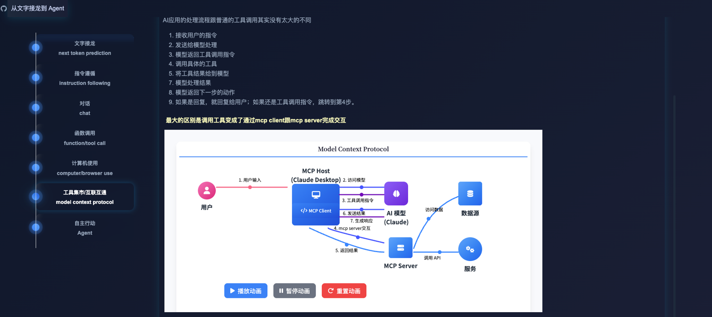

# 从文字接龙到 Agent

一个交互式可视化项目，展示大语言模型从最基础的下一个词元预测，发展到现代智能体（Agent）的演进过程。
[在线访问](https://nil4u.github.io/next-token-prediction-to-agent/)

[](./assets/demo.mp4)

## 项目简介

本项目通过时间轴的形式，展示了大语言模型的七个发展阶段：

1. 文字接龙 (Next Token Prediction)
2. 指令遵循 (Instruction Following)
3. 对话 (Chat)
4. 函数调用 (Function/Tool Call)
5. 计算机使用 (Computer/Browser Use)
6. 工具集市/互联互通 (Model Context Protocol)
7. 自主行动 (Agent)

每个阶段都包含：
- 产品形态演示
- API 接口示例
- 工作原理说明
- 关键技术问题
- 阶段特点
- 与其他阶段的对比

## 本地运行

1. 克隆项目：
```bash
git clone https://github.com/nil4u/next-token-prediction-to-agent.git
cd next-token-prediction-to-agent
```

2. 使用任意 HTTP 服务器启动项目，例如：
```bash
# 使用 Python 启动简单的 HTTP 服务器
python -m http.server 8000
```

3. 在浏览器中访问 `http://localhost:8000`

## 技术栈

- HTML5
- CSS3 (Tailwind CSS)
- JavaScript
- Highlight.js
- Font Awesome
- Google Fonts (Noto Sans SC & Noto Serif SC)
